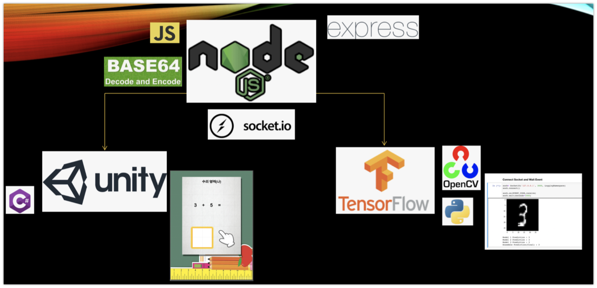

# Math-Writer

Unity Game &amp; MNIST Machine Learning

Author - MJ Studio

### Steps

You must install some packages for execute jupyter notebook source code.

pip install socketIO-client3 // package for socket.IO
pip install opencv-python // package for OpenCV를 위한 패키지

### Files Descriptions

#### -Unity Build : Unity game build(.exe for Windows)

#### -Math Writer : Unity game project directory

#### -Node : Node.js project directory

#### -Tensorflow
	ImageCrawler.ipynb : Crawler for downloading 1000 images with different 20 keywords
	Image2csv.ipynb : Program for preprocessing images and convert to csv data set
	mnist-non_mnist.csv : 1000 MNIST test dataset + 850 Non-MNIST test dataset
	mnist-non_mnist_test.csv : Dataset for testing models
	Model+Socket.ipynb : Main Model + Socket source code
	non-mnist : directory for 1000 images from crawling
	
### Usage
	1. You can execute unity game in Unity Build directory.
	2. In the Node directory, you can enter "npm start" after downloading node modules.
	3. Execute Model+Socket.ipynb jupyter notebook python code with jupyter notebook

### Sample Images
  
  
  

       

#### Thank you
